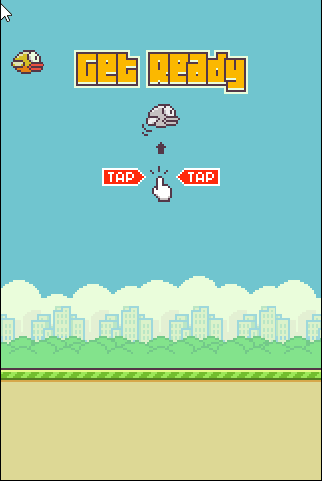

<p align="center">
    <h1 align="center">Clone do (flappy bird)</h1>
    <h2 align="center">Um clone do jogo flappy bird em javascript</h2>
</p>

<div align="center" >
    
    </div>

---
### 🛠 Techs
  - [javascript](https://nodejs.org/en/)
  - [CANVAS](https://developer.mozilla.org/en-US/docs/Web/API/Canvas_API)
---

## :bookmark: About
Este projeto é uma recriação fiel de um jogo existente chamado "Flappy Bird", implementado inteiramente com JavaScript e otimizado para funcionar perfeitamente em navegadores modernos.

---

### Para rodar o código

#### Cloning
```ps
  # Clone o repositório utilizando o git
  $ git clone https://github.com/BrenoVieira41/flappy-bird.git
```